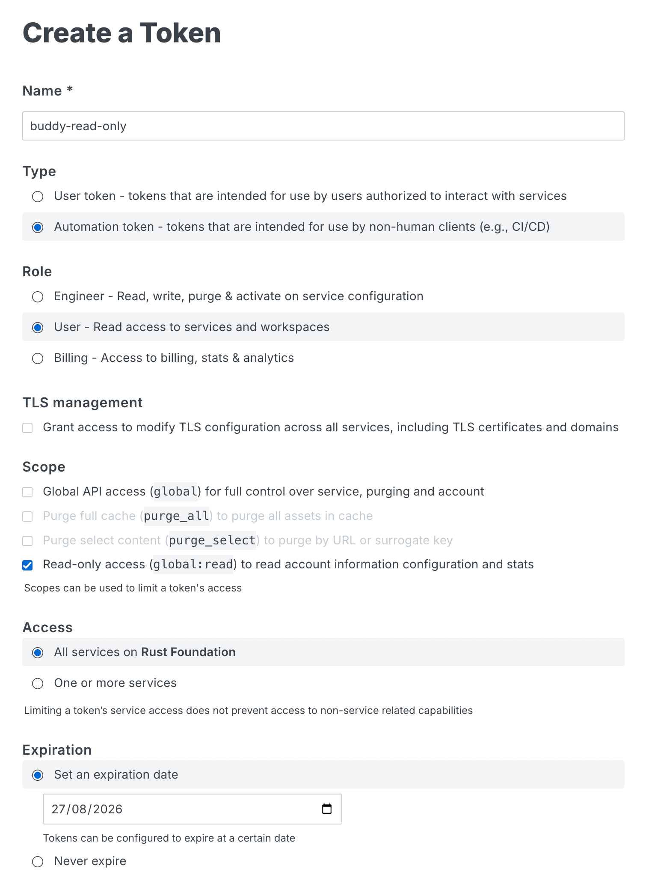

# Authentication

## Datadog authentication

Buddy uses a [Datadog service access token](https://docs.datadoghq.com/account_management/service-access-tokens/)
owned by a service account. This is preferable to an application key for this
non-interactive use case: it is scoped by default, can expire, does not belong to
an employee, and does not require a separate API key.

The shared token is stored in the Rust Foundation 1Password `Infrastructure`
vault as an item named `datadog-read-only`, in a field named
`credential`. Buddy reads it using the fixed secret reference
`op://Infrastructure/datadog-read-only/credential`.

Sign in to the 1Password CLI on the host, then configure and verify the guest:

```sh
just login-datadog
```

Check that the guest has the current token from 1Password and that its
service-account identity, roles, and permissions match the documented
[permissions snapshot](datadog-permissions.json):

```sh
just assert-datadog-credentials
```

The assertion compares token hashes without printing or storing the token. It
then uses Pup's authenticated raw API command to query the current token's
scopes and call Datadog's `/api/v2/current_user` endpoint. The normalized token
scopes, service-account identity, roles, and role permissions are compared with
the snapshot. This introspection requires the read-only `org_app_keys_read`
permission.

Pup does not have a dedicated command that lists permissions. Maintainers can
refresh the snapshot through Pup after intentionally changing the service
account or its role:

```sh
just dump-datadog-permissions
git diff -- docs/datadog-permissions.json
```

The dump command first verifies that the VM has the current token from
1Password, so a stale guest credential cannot replace the documented baseline.
Review every identity, role, and permission change before committing the
updated file.

### Replace an expired Datadog token

Do not create a token during normal setup because the token already exists.
Create a new token from scratch only when the old one has expired:

1. Open [Datadog Organization Settings > Service Accounts](https://app.datadoghq.com/organization-settings/service-accounts).
2. Open the existing `Read only` service account. It uses the `safe-readonly` role,
   which is the permission boundary for its tokens.
3. Under **Access Tokens**, if a token name `buddy` exists, delete it.
4. Select **New Token**.
5. Name the token `buddy`, choose an expiration date, and select
   **Select Scopes**. Select **Select all Read**, save the scopes, and
   create the token. Selecting every read-only token scope is safe here because
   the service account's `safe-readonly` role has already limited the
   effective permissions.
6. Copy the token immediately. Datadog shows the secret only once.
7. Replace `credential` in the 1Password `datadog-read-only` item with the new
   token, which begins with `ddsat_`.
8. Run `just login-datadog`. This copies the replacement into the VM and verifies
   it with a read-only Datadog request.
9. Run `just assert-datadog-credentials`. The checked-in permissions should not
   change when only the token is rotated.

## Fastly authentication

Buddy uses a [Fastly automation token](https://www.fastly.com/documentation/guides/account-info/user-and-account-management/using-api-tokens/). Unlike a user token, an automation token is
not tied to an employee's account lifecycle. The token has the `global:read`
scope on all services, and has an expiration date.

The shared token is stored in the Rust Foundation 1Password `Infrastructure`
vault as an item named `fastly-read-only`, in a field named `credential`.
Buddy reads it using the fixed secret reference
`op://Infrastructure/fastly-read-only/credential`.

Sign in to the 1Password CLI on the host, then configure and verify the guest:

```sh
just login-fastly
```

This exports the token through the Fastly CLI's supported
`FASTLY_API_TOKEN` environment variable. It also sets
`FASTLY_DISABLE_AUTH_COMMAND=1` because Fastly authentication is managed
externally by Buddy rather than by a stored CLI profile.

### Replace an expired Fastly token

Do not create a token during normal setup because the token already exists.
Create a new token from scratch only when the old one has expired:

1. Open [Account > API tokens > Account tokens](https://manage.fastly.com/account/tokens). If an automation token named `buddy-read-only` exists, revoke it.
2. Open [Account > API tokens > Personal tokens](https://manage.fastly.com/account/personal/tokens).
3. Select **Create token**, name it `buddy-read-only`, and choose the settings of the screenshot below.
4. Create and immediately copy the token. Fastly shows the secret only once.
5. Replace `credential` in the 1Password `fastly-read-only` item with the new
   token.
6. Run `just login-fastly`. This copies the replacement into the VM and
   verifies it with a read-only Fastly request.


